# Отчёт по лабораторной работе №6
## Основы работы с системой контроля версий Git

**Студент:** Матвеев Н.С.  
**Группа:** 4414  

---

# 1. Цель работы

Освоить систему контроля версий Git: настройку, клонирование, управление ветками, создание и откат коммитов, решение конфликтов, слияние веток, а также оформление отчётов в формате Markdown.

---

# 2. Установка и настройка Git

После установки Git была выполнена глобальная конфигурация имени пользователя и email:

```bash
git config --global user.name "Матвеев Н.С."
git config --global user.email "lordtkach@gmail.com"
```

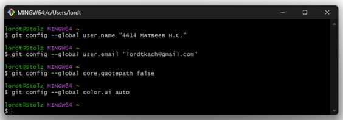  


---

# 3. Клонирование удалённого репозитория

Клонирование в локальную папку:

```bash
git clone <https://github.com/Lord-Tkach/LR6>
```

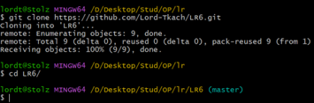

---

# 4. Добавление файла через GitHub и получение изменений

```bash
git pull
```

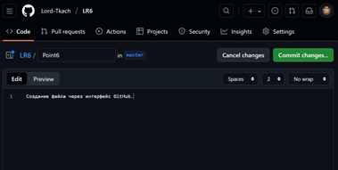  
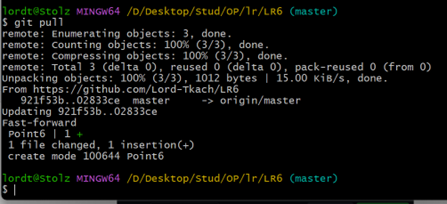  
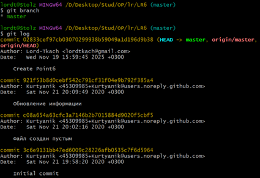

---

# 5. Создание ветки new-feature и внесение изменений

Создание новой ветки:

```bash
git checkout -b new-feature
```

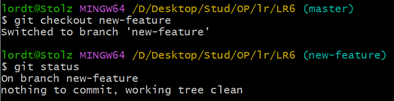  
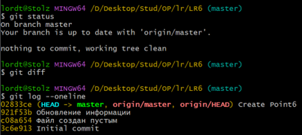

Внесение изменений:

```bash
git add README.md
git commit -m "Добавлена строка из ветки new-feature"
```


---

# 6. Слияние ветки new-feature в master

## 6.1. Выполнение слияния

```bash
git checkout master
git merge new-feature
```

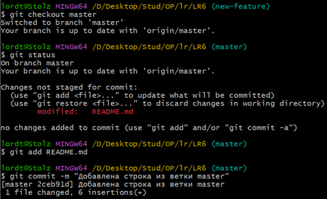

При слиянии возник конфликт:

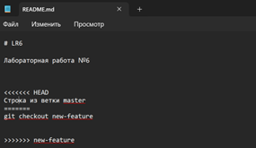

---

## 6.2. Разрешение конфликта

```bash
git add README.md
git commit -m "Конфликт при слиянии решён"
```

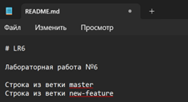  


---

# 7. Удаление ветки new-feature

```bash
git branch -d new-feature
git push origin --delete new-feature
```

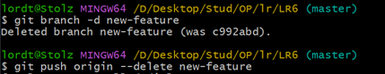

---

# 8. Создание нескольких последовательных коммитов

```bash
git add README.md
git commit -m "Изменение №1"

git add README.md
git commit -m "Изменение №2"

git add README.md
git commit -m "Изменение №3"
```

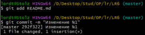  
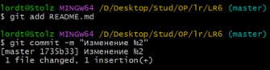  
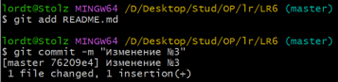  
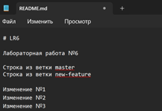

---

# 9. Откат второго коммита

```bash
git revert <hash второго коммита>
git add README.md
git revert --continue
```


---

# 10. Создание ветки report

```bash
git checkout -b report
```

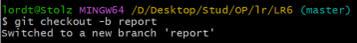

---

# 11. Начало оформления отчёта

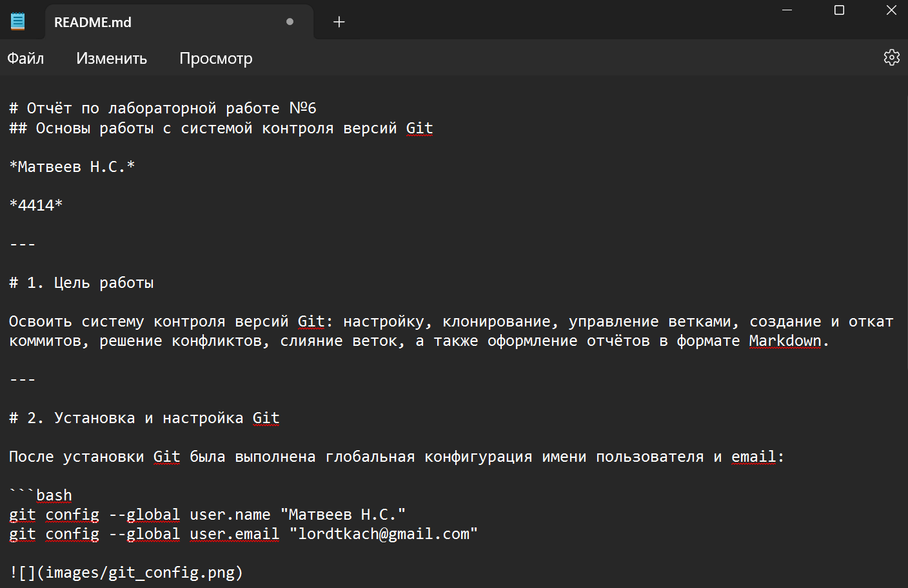  
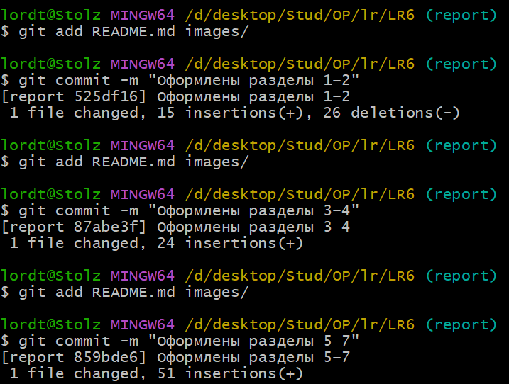

---

# 12. Лог команд (без вывода результата)

```
git init
git clone
git checkout -b new-feature
git add
git commit
git checkout master
git merge new-feature
git branch -d new-feature
git revert
git checkout -b report
git add README.md images/
git commit -m "..."
```

---

# 13. История операций

```bash
git log --pretty=format:"%h %ad %an %s" --date=short
```

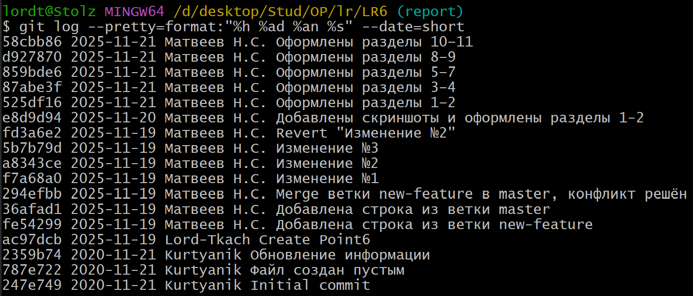

---

# 14. Финальная фиксация отчёта

```bash
git add README.md images/
git commit -m "Финальная версия отчёта"
```

---

# 15. Отправка отчёта в GitHub

```bash
git push origin report
```


---

# 16. Выводы

В ходе выполнения лабораторной работы были изучены основные инструменты Git: настройка, создание коммитов, работа с ветками, слияние и решение конфликтов, откат коммитов, ведение истории, использование GitHub и оформление отчёта в Markdown.

```